# Deployment of Socks Shop, a microservices-based application, on Kubernetes using Infrastructure as Code (IaaC).

## Project Overview:

We aim to deploy a microservices-based application, specifically the Socks Shop, using a modern approach that emphasizes automation and efficiency. The goal is to use Infrastructure as Code (IaaC) for rapid and reliable deployment on Kubernetes. The main task is to set up the Socks Shop application, a demonstration of a microservices architecture, available on GitHub. Using tools and technologies that automate the setup process, ensuring that the application can be deployed quickly and consistently.

## Project prerequisites:

-The following has to be installed/configured;

- Terraform
- AWS Account
- AWS cli
- Kubernetes
- Kubectl
- Helm
- Prometheus & grafana installed with helm
- ELK Stack
- Let's Encrypt

## Deployment Steps:

1. Configure AWS CLI: Set up AWS credentials and configure the AWS CLI for interacting with AWS services.

1. Terraform Configuration:

- Create a directory "terraform" to keep all teraform configuration files; You can get configuration commands for each file from the official terraform documentation.

```bash
mkdir terraform
cd terraform
```

- Clone repo from the official [terraform](https://github.com/hashicorp/learn-terraform-provision-eks-cluster) website

- Edit the ```main.tf outputs.tf variable.tf terraform.tf``` to fit desired eks cluster to be provisioned

- Run `terraform init` to initialize terraform

- `terraform plan` to check all the modules to be configured correctly

- `terraform apply --auto-approve` to apply without a prompt

  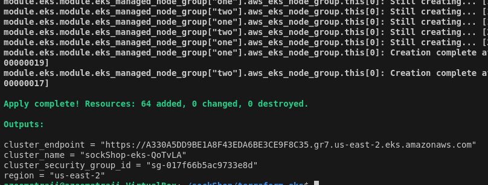

- Below are images of eks cluster; nodes, vpc; security groups provisioned by terraform:

  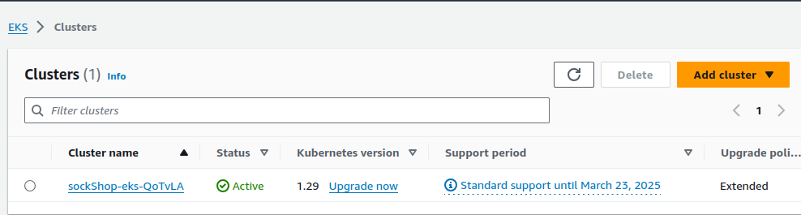
  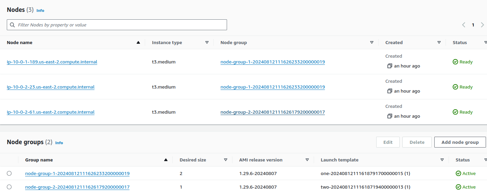
  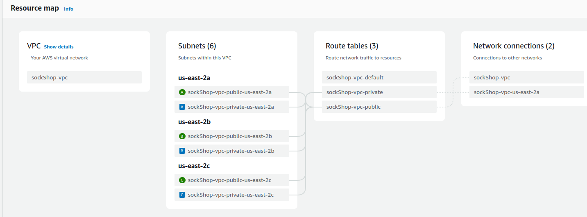
  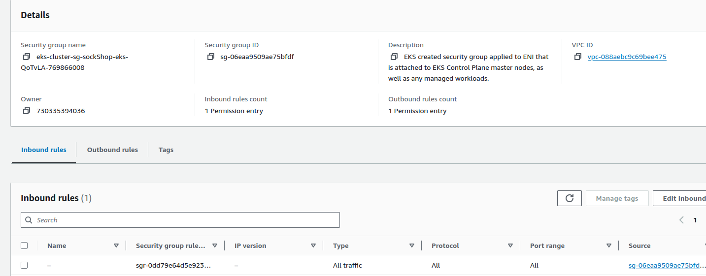

1. Kubernetes Configuration:

- Create a folder to keep all kubernetes configuration files.

```bash
mkdir kubernetes
cd kubernetes
```

- Create both deployment.yaml and ingress.yaml files in the directory.

- Configure the kubectl to connect to the EKS cluster, the specified region and the cluster name using the outputs.tf values

 `aws eks --region $(terraform output -raw region) update-kubeconfig \
    --name $(terraform output -raw cluster_name)`

- To verify kubectl is connected run

`kubectl --version` this would display both your eks cluster and your kubectl version

- Kubectl apply -f deployment.yaml

  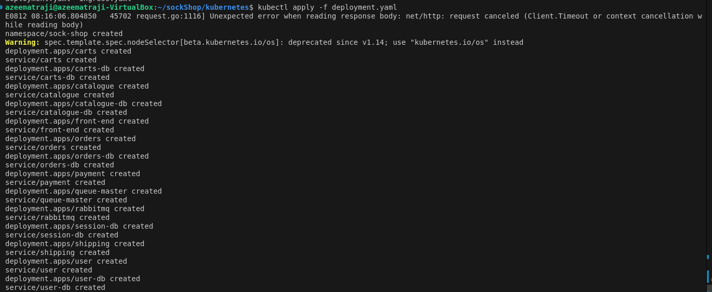
  

- Verify the deployment: run `kubectl get all -A` to get all the running nodes and pods

  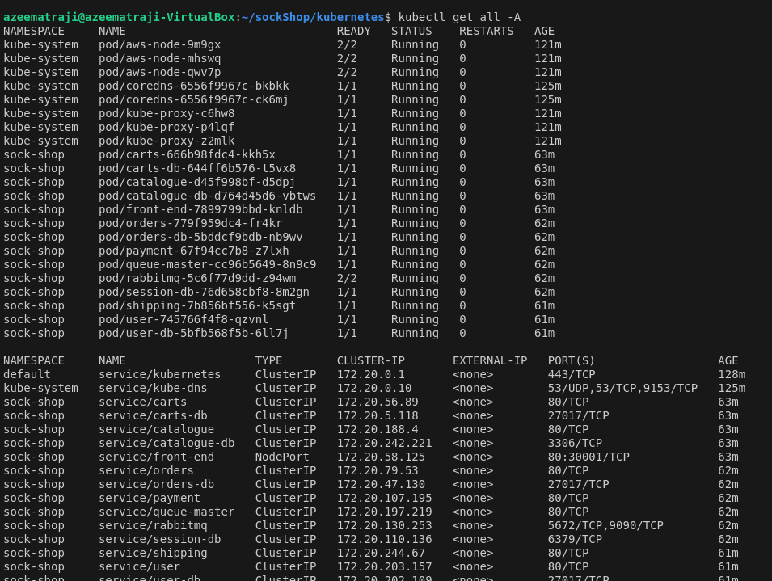
  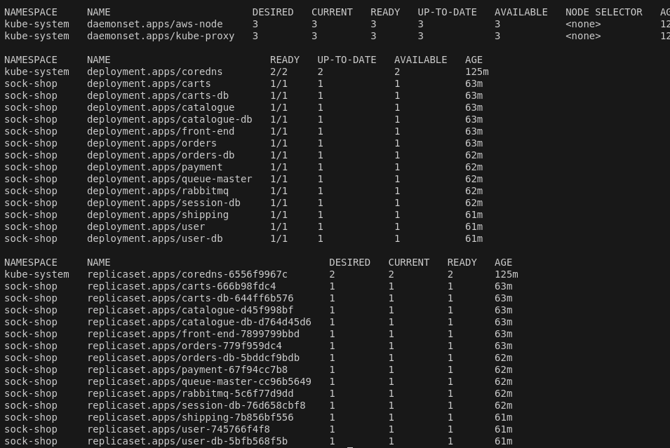

- Deployments on aws console:

  
  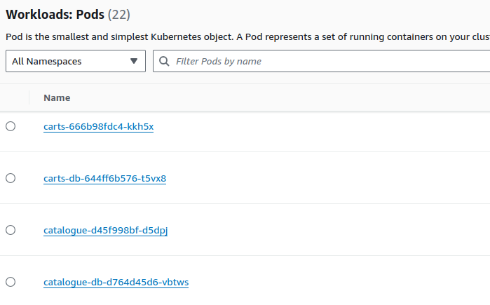
  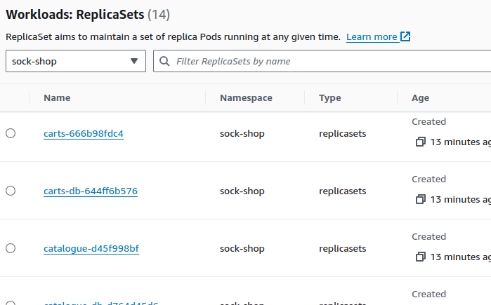

1. To access front-end of the Application on our browser:

- ingress-nginx chart can be installed with helm, this creates a loadbalancer that would help route traffic to our domain to serve our application

```bash
helm repo add ingress https://kubernetes.github.io/ingress-nginx
helm repo update
```

`helm install ingress ingress-nginx/ingress-nginx`

- Then specify a domain name hosted in aws route53 within our [ingress](./ingress.yaml) configurations where the front-end can be displayed 

- Run `kubectl apply -f ingress.yaml` to apply the ingress file

- front-end displayed on the broswer

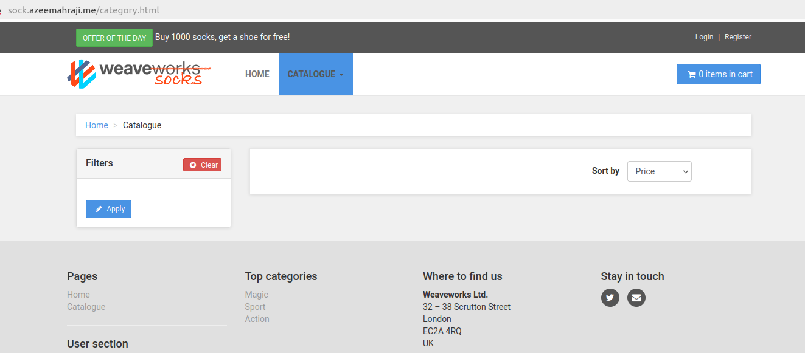

1. For the application should run on HTTPS with a Let’s Encrypt certificate

- chart can be installed with helm, with a release name of cert-manager

  `helm repo add jetstack https://charts.jetstack.io --force-update`

  `helm install cert-manager --namespace cert-manager --version v1.15.3 jetstack/cert-manager`

- Create an [issuer](./certicate.yaml) file to be issued certicate

- Edit your [ingress](./ingress.yaml) and run `kubectl apply -f ingress.yaml`

- HTTPS Front-end displayed on the broswer

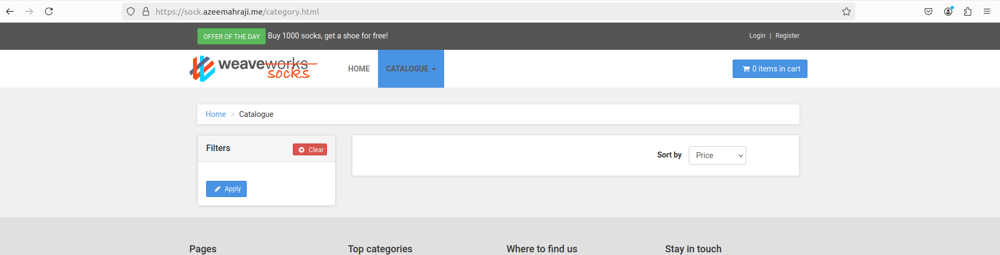

  
  
  
